# AzTestPolicy PowerShell module

This PowerShell module that provides pre-defined **Pester**  ([PSGallery](https://www.powershellgallery.com/packages/Pester/), [GitHub](https://github.com/Pester/Pester)) tests for Azure Policy and Initiative definitions.  It tests the syntax of the Azure Policy and Initiative definition JSON files.

We intend on create a private feed from which our Build and Release pipelines can consume the packages.  The below walk through will help pack, publish, and consume the packages.

## Azure Artifacts

[Azure Artifacts Overview](https://azure.microsoft.com/en-us/services/devops/artifacts/)

Create and share Maven, npm, NuGet, and Python package feeds from public and private sources.  This is important.  We are going to use a user generated powershell module 'AzTestPolicy'.   While we can find a publically available 'AzPolicyTest' in the [Powershell Gallery](https://www.powershellgallery.com/) we will use a 'Private' repository.  There are so many advantages to a private repository to include control over versioning, ensuring existence, and quick publishing.  

Creating an Azure Artifact repository.
Navigate to your project repository and click on artifacts.

- 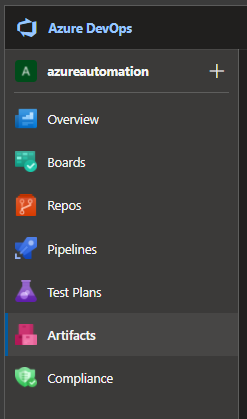

Click 'Create Feed' and fill in the settings:

- Name: azpolicy
- Visibility: 'Members of ***organization***'
- Upstream sources: 'checked' ***this allows you to register the resource and pull 'public' artifacts***
- Scope: Organization
- 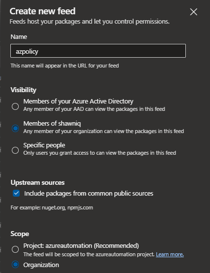

After the feed is created we will change a few settings:

- You should the feed in a drop-down list
- If you have multiple feeds you can select the feed in the drop-down and then click the 'Gear' icon
- 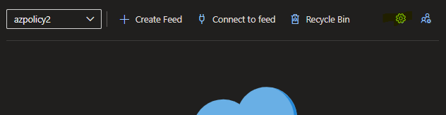
- Navigate to 'Permissions' as we will want to add the Build service to the permission baseline
- 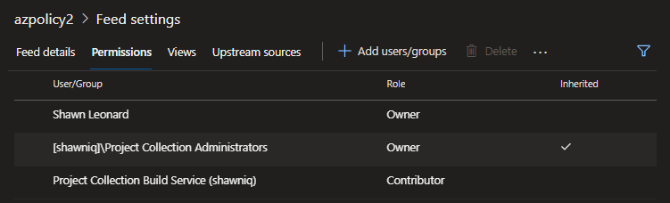
- Click 'Add users/groups' and search for '***project name*** Build Service (***organization***)
- 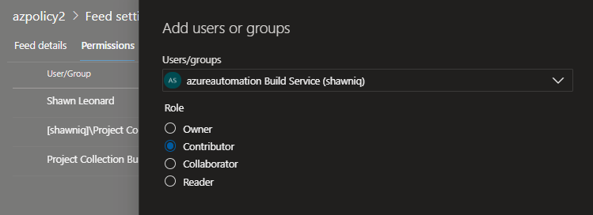
- Choose contributor then click Save.  You could choose 'reader' at this point as our pipeline work will only PULL from the repository.  But if you ever want to publish to it, in the pipeline, you'll need 'contributor' associated with the Build service.
- Upstream sources are great to claim public sources without having to publish them privately.  We won't need all the sources available so let's remove a couple.  Select the feed and then click 'Delete'
- We will keep the 'Nuget Gallery' as we want to pull 'Pester' in our pipelines.
- 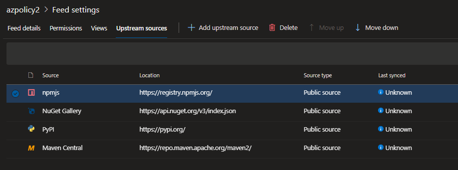

## Nuget

Now that we have a feed we will want to publish the 'AzTestPolicy' module found in this repository.  
If you have not already downloaded nuget and set it in your path do the following:

- Download the latest nuget distro
- [Nuget download](https://www.nuget.org/downloads)
- Place it in a folder on your machine.
- Update the 'Edit environment variables for your account' ***windows***
- Update the 'Path' user variable with a new entry to the folder containing your nuget download.
- This will enable any 'nuget' command to be run anywhere on your machine in a command window.

Lets pack the powershell module

- Open a command window or terminal window

```cmd
# Assumption:
# You have cloned this repository (https://github.com/shawnadrockleonard/Azure)
# Cloned to c:\repos\azure

cd c:\repos\azure\policies\modules
nuget pack .\AzTestPolicy\AzTestPolicy.nuspec
```

After the nuget pack you should see a new file 'AzTestPolicy.1.0.1.nupkg'

- 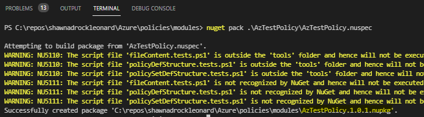

Now that we have our nuget package we can publish to it.  
But we need a few steps.

1. We need a 'Personal Access Token'
1. We need to add a nuget source locally
1. We need to publish the nuget package

Top right, click on your picture, click the elipse next to 'View account' and choose 'User settings', then choose 'Personal access tokens'

- 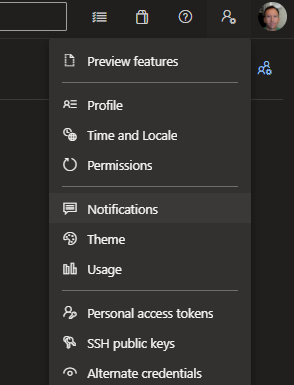

Let's create a PAT with the scopes (Build - read & execute, Packaging - Read, write, & manage)

- 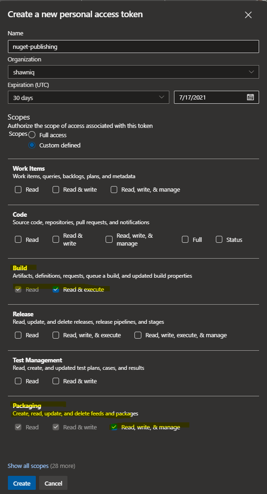

Once you click 'Create' you need to copy the token.  It will never show again.  Click the copy icon and store it somewhere safe.  I prefer to store it in an Az Key Vault.  You can also store it in a 'User environment variable' and retreive it when you need it.  

- 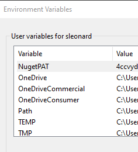

Now we can register the nuget feed

- Get the Artifact feed URL
- 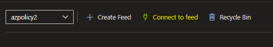
- Click 'Connect to feed'
- Choose Nuget.exe
- This will provide you the URL to the nuget feed along with other nuget related details.
- You can manually update the global nuget.config file or you can run the following commands in powershell

```powershell
# This assumes I'm in the directory where we previously packed the nuget package
# This assumes I have either set the User or System environment variable 'NugetPAT' with my Personal Access Token

# For this example my Artifact details are here

$FeedUrl = "https://pkgs.dev.azure.com/shawniq/_packaging/azpolicy2/nuget/v3/index.json"
$FeedPAT = $Env:NugetPAT
$Username = "place your username / email address"

Set-Location c:\repos\azure\policies\modules

# Add the nuget source
nuget sources Add -Name "PowershellModules" -Source $FeedUrl -username $Username -password $FeedPAT

# Push the package
nuget push -Source "PowershellModules" -ApiKey AzureDevOpsServices ".\AzTestPolicy.1.0.1.nupkg"
# nuget push -Source "PowershellModules" -ApiKey AzureDevOpsServices ".\pester.4.7.0.nupkg"

```

- The result should look like this:
- 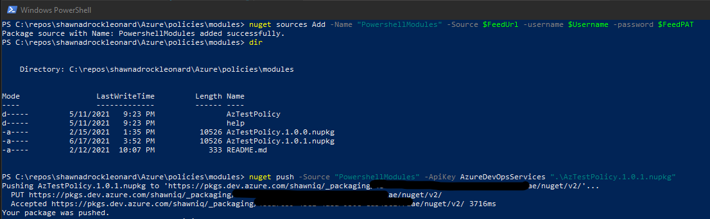
- In DevOps the Feed should now look like this:
- 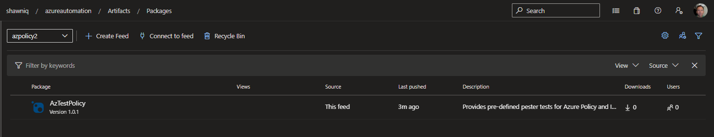

## Return to main article

[Main article](../readme.md)
