# Azure Subscription Management

This is a readme to extend a fantastic [Blog](https://blog.tyang.org/2019/05/19/deploying-azure-policy-definitions-via-azure-devops-part-1/) with respect to validating and deploying Policies to Azure.    This will be an attempt to extend that discussion with Azure RBAC, DevOps (pipelines), DevOps (Artifacts), and GitHub integrations.

A few of the topics we will cover:

- **Azure Roles Based Access Controls:** RBAC ensures users and automated accounts mainain least privilege ***only the minimum access necessary to perform an operation should be granted***
- **Azure Resource Manager Templates for Policy:** Azure policies ensure your Az resources adhere to corporate/agency standards.
- **Azure Dev Ops:** pipelines (Build, Release) enable continuous development, validation, integration, and deployment
- **GitHub:** yaml, source code, and documentation. We'll then integrate with DevOps for full lifecycle
- **Azure:** review Azure pre and post deployment, compliance, and resources.  

## Tutorials you'll find interesting

I don't believe I should cover any of these topics in this readme.  I highly recommend you read these either before or after you follow the steps I outline as we'll cover these topics.

### Security | RBAC

Least privilege is an important topic.  You can assign individual policies to users or service principals but I've found the most effective approach is management groups.  Then assign users, groups, service principals to the mgmt groups.  Assign roles to the mgmt groups and you have an effective way of maintaining and reviewing access across the platform.  Read these links to understand this terminology.

- [Quickstart: Create a management group](https://docs.microsoft.com/en-us/azure/governance/management-groups/create-management-group-portal)
- [Organizing resources / hierarchy](https://docs.microsoft.com/en-us/azure/governance/management-groups/overview#hierarchy-of-management-groups-and-subscriptions)
- [Resource Policy Contributor](https://docs.microsoft.com/en-us/azure/role-based-access-control/built-in-roles#resource-policy-contributor)

### Policies

Policy Definitions and Assignments are a fantastic way to ensure your Az Subscriptions are well maintained.  Included in this Github repo are a number of policy definitions.  However, understanding what you can do and should do with policies can be found in these links.

- [Azure Policy built-in policy definitions](https://docs.microsoft.com/en-us/azure/governance/policy/samples/built-in-policies)
- [Azure Policy definition structure](https://docs.microsoft.com/en-us/azure/governance/policy/concepts/definition-structure)
- [Tutorial: Create and manage policies to enforce compliance](https://docs.microsoft.com/en-us/azure/governance/policy/tutorials/create-and-manage)
- [Tutorial: Manage tag governance with Azure Policy](https://docs.microsoft.com/en-us/azure/governance/policy/tutorials/govern-tags)
- [Open source policy definitions on GitHub](https://github.com/Azure/azure-policy)

### Build GitHub repositories

We will build github repositories in a DevOps pipeline.  I'll take a few screenshots but for a more in depth outline take a peek at this detail.

- [Build GitHub repositories](https://docs.microsoft.com/en-us/azure/devops/pipelines/repos/github?view=azure-devops&tabs=yaml)

## Let's get started

### Azure Artifacts

[Azure Artifacts Overview [External]](https://azure.microsoft.com/en-us/services/devops/artifacts/)  

Create and share Maven, npm, NuGet, and Python package feeds from public and private sources.  This is important.  We are going to use a user generated powershell module 'AzTestPolicy'.   Follow this step by step process to create an Artifact feed and publish a powershell module in the nuget feed.

[Azure Artifacts Walkthrough](./modules/README.md)

### Service Principals

We will use Service Principals to connect Azure DevOps with Azure.  You can, when using Azure Public or Azure Commercial, walk through a Service Principal connection wizard.  We are going to walk through the steps manually so you understand what is happening.

I've included a helpful script to generate a SPN in Azure and assign it an initial RBAC authorization.
You can find a walkthrough of the script and Azure details here: [Walkthrough](.\scripts\AzServicePrincipals\readme.md)

### Azure Key Vault

While many teams / organizations will place their secrets in Build / Release pipelines I find this very frustrating in terms of policies.  

- Do the teams keep the secrets in plain text?  
- Do the teams have to replicate these variables across many pipelines?
- When a key changes, how does the development team receive a notification?
- What is the rotation policy on any of those secrets?

To address this issue I highly recommend variable groups and integration with a Key Vault.
Service Connection `Variable Groups`
Secrets, Passwords, can be stored in encrypted variables but a **_better_** option is to create an Azure Key Vault and store your secrets in a rotating store.

A prerequisite for these steps is to have generated a Service Principal above.

1. Navigate to Azure
1. Create a Key Vault
1. Associate the Service Principal we created earlier with **Secret Permissions** [Get, List]
    - 
1. Create a _Secret_
    - 
1. Use Azure DevOps Pipeline libraries *click Libraries*
    - 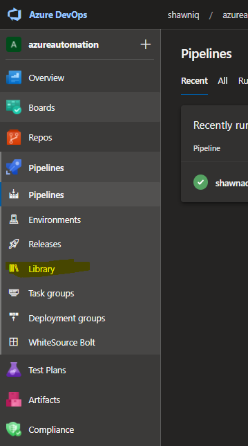
1. Create a new Variable Group *common-keyvault*
    - 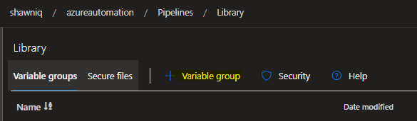
1. Enable 'Link secrets from an Azure key vault as variables'
1. Choose the Azure subscription service principal we've already configured.
1. If you've selected the correct SPN it should be able to find the Key Vault we created in step 2.
    - 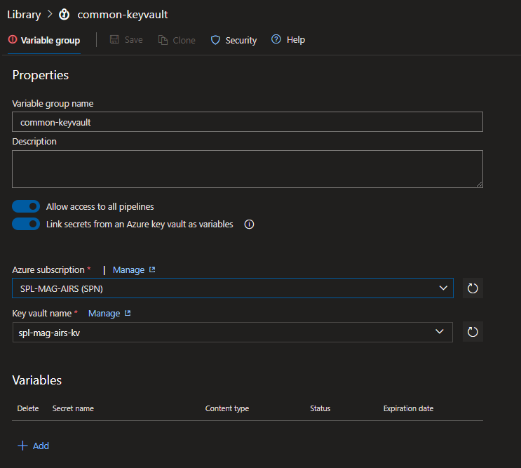
1. You can name the group 'common-keyvault' to identify it as reusable variables
1. Now click '+ Add' and it will query the secrets in the Vault
    - 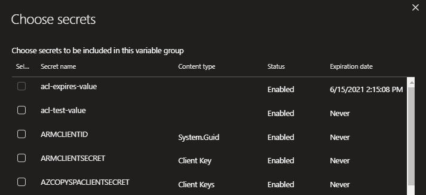
1. Select a Key Vault secret _Notice the expiration if specified in the Key Vault_
    - 
    - 

Now we can use "Key Vault" secrets in our pipelines natively and gain the strength of rolling values and expirable values.
&nbsp;

&nbsp;

### Azure DevOps Build Pipeline ***Classic***

Navigate to pipelines and let's create a *new* pipeline.

1. Click 'New pipeline'
    - 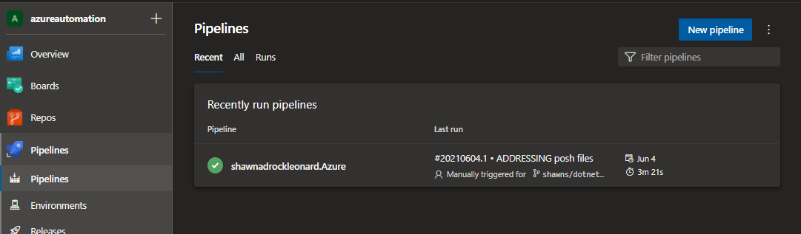
1. Choose the 'Classic Editor' **The next outline will cover a yaml file**
    - 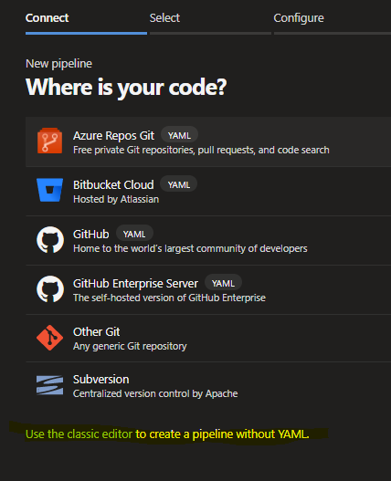
1. If your code was cloned into DevOps or you want to run it from DevOps select your Project and Repo
    - 
1. For this demo I'm going to select GitHub.  
    - 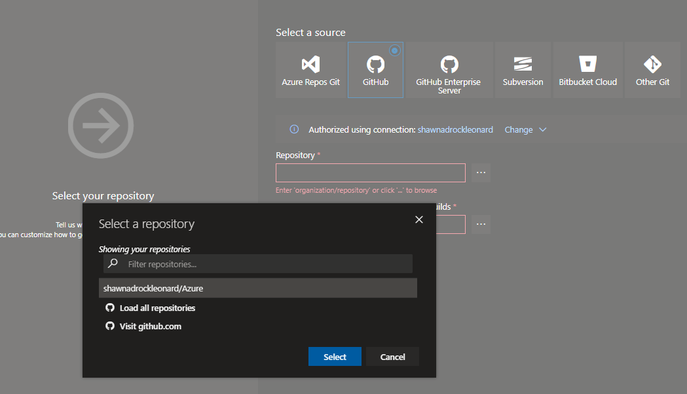
1. Note: ***I've previously authenticated to GitHub so shawnadrockleonard/azure appears.  You'll want to create a new service connection***
    - 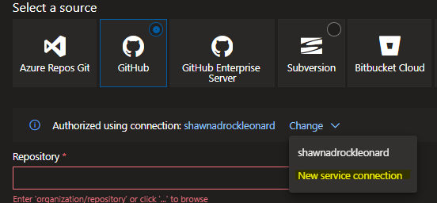
1. Note: ***Once you have a service connection you can browse for your repos and target a specific branch*** then click 'Continue'
    - 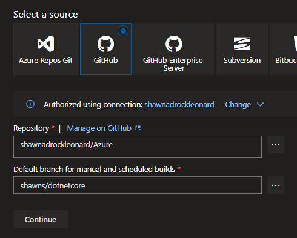
1. We are using a 'Classic' pipeline so on the next step choose 'Empty job'
    - 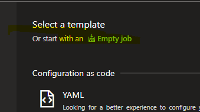
1. Pipeline (use the default) and give it a name '*organization*-CI'
    - 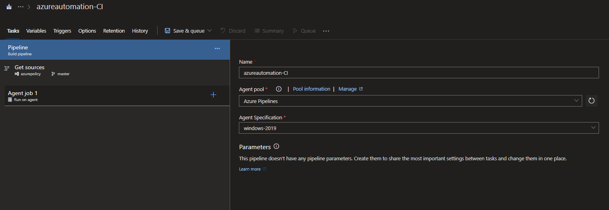
1. Link to your existing Variables groups created earlier
    - 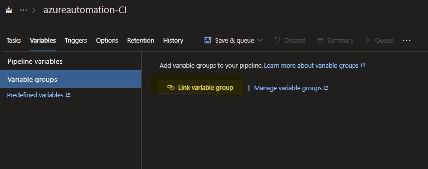
1. Select the variable group we created earlier 'common-keyvault'
    - 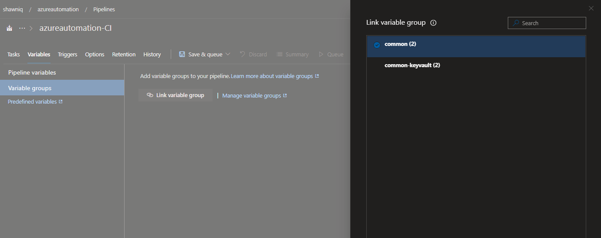
1. The list of variables we selected in the 'Library' steps are now available in the pipeline
    - 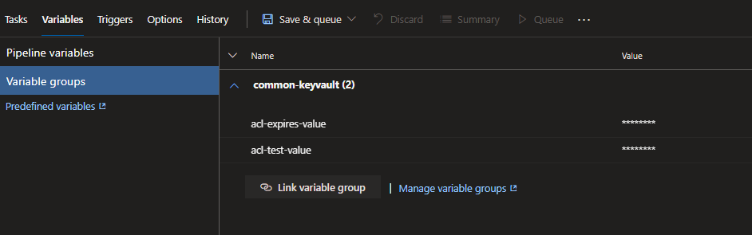
1. Let's rename the 'Run on agent' Agent job to 'Test policy and Initiative Definitions'
1. Then click the '+' on the Agent job to add a tasks 'Powershell'
    - 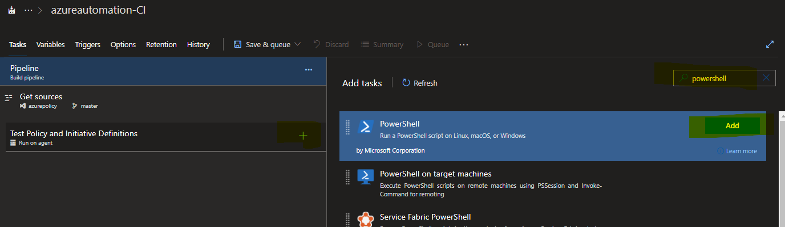
1. We will leave 'File path' selected.  As we've connected to this repo in the service connection when i click the elipse I'll navigate to the source code.  I've included a powershell script [Get-ArtifactFeedName.ps1](.\policies\Get-ArtifactFeedName.ps1)
    - 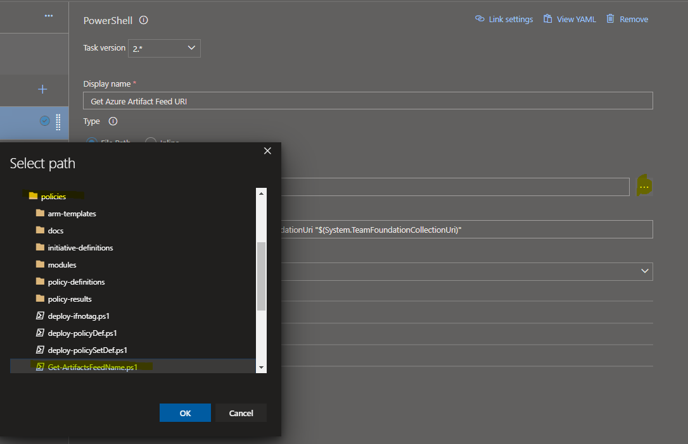
1. This particular screen has a dependency on a variable 'ArtifactsFeedName' which we need to set to our newly created Artifact Feed name.
    - 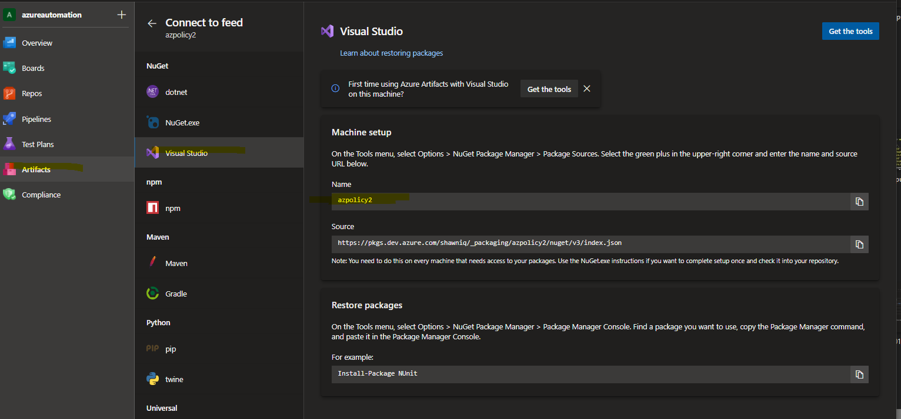
    - 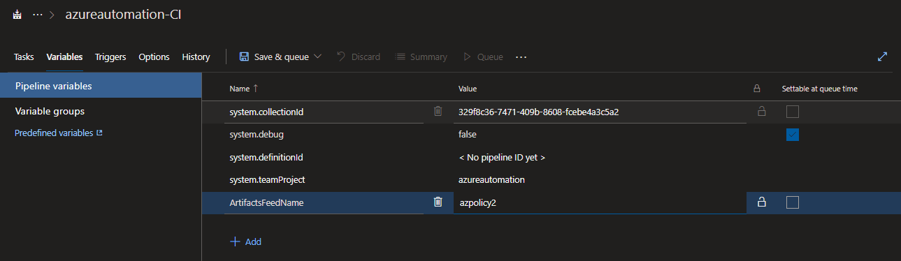
1. In previous steps we added '*project* Build Service (*org*)' with permissions to Read the Artifact Feed.  We need to allow the authentication/handshake to enable connectivity. Navigate to 'Tasks' and click on the Agent job then check the box 'Allow scripts to access the OAuth token'
    - 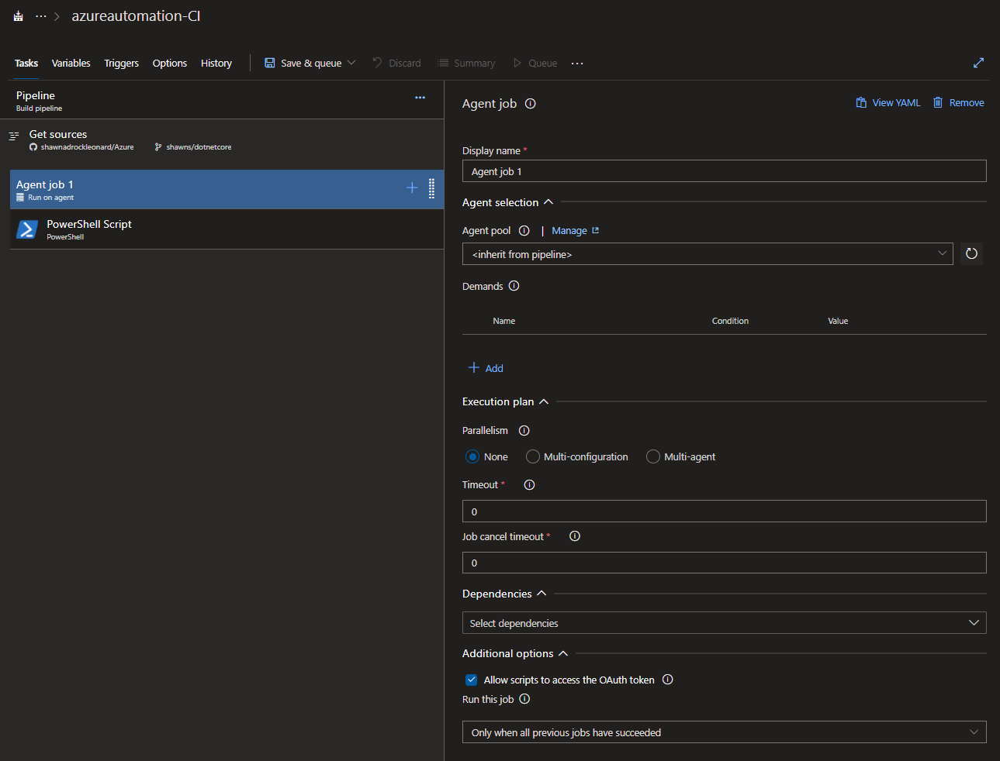
1. Save and Queue the build to validate our Pipeline
    - 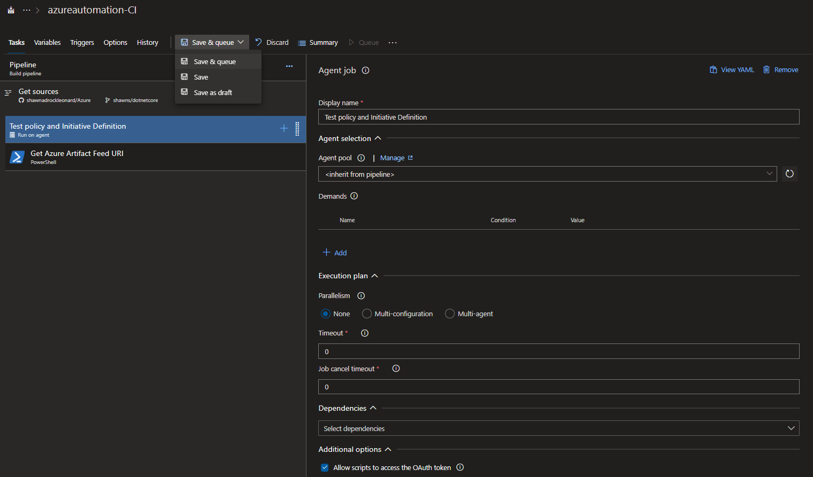
1. Run the pipeline
    - 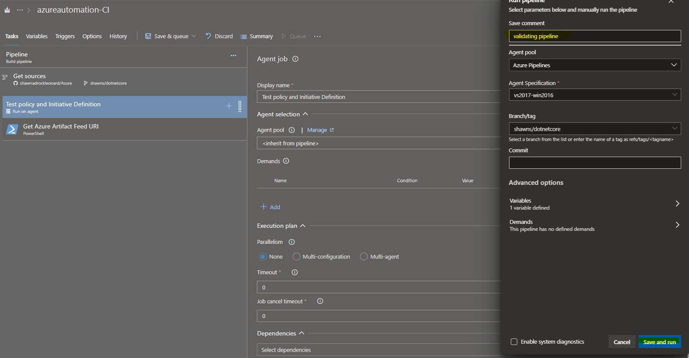
1. The pipeline is queued and awaiting a Microsoft hosted agent.
    - 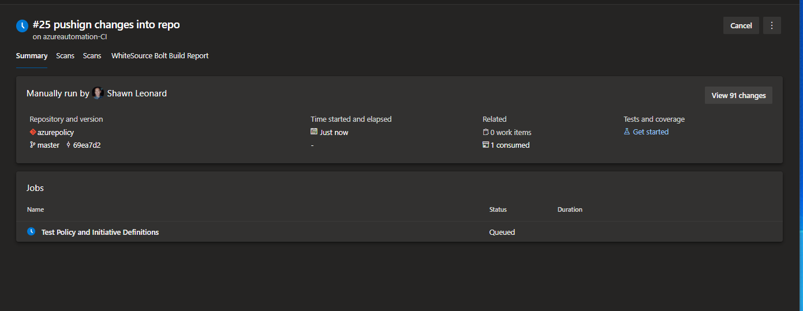
1. Review the pipeline run log and validate each task/step
    - 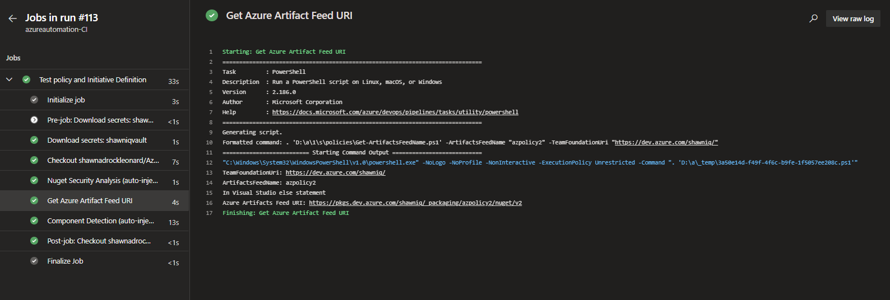
