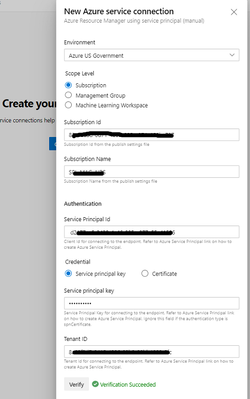

# Azure Subscription Policies

This is a demo repository that contains:

**Azure Resource Manager Templates for Policy:** Azure policies can be curated or deployed via the Azure Portal or through scripts. These policies help ensure your resources adhere to corporate/agency standards.

- There are 2 policy definitions contained here:
  1. [default-resourcegroup-ifnotag](https://github.com/shawnadrockleonard/Azure/tree/shawns/dotnetcore/policy-definitions/default-resourcegroup-ifnotag) enables Add/Update Resource Group tag from the Subscription Tag if one does not exist or is empty
  2. [default-resourcegroup-overwritetag](https://github.com/shawnadrockleonard/Azure/tree/shawns/dotnetcore/policy-definitions/default-resourcegroup-overwritetag) enables Overwrite Resource Group tag from the Subscription Tag regardless of its value.

## Tutorials

- [Azure Policy built-in policy definitions](https://docs.microsoft.com/en-us/azure/governance/policy/samples/built-in-policies)
- [Azure Policy definition structure](https://docs.microsoft.com/en-us/azure/governance/policy/concepts/definition-structure)
- [Tutorial: Create and manage policies to enforce compliance](https://docs.microsoft.com/en-us/azure/governance/policy/tutorials/create-and-manage)
- [Tutorial: Manage tag governance with Azure Policy](https://docs.microsoft.com/en-us/azure/governance/policy/tutorials/govern-tags)

## Samples / Templates / Source

You can find Azure Policy community templates on [github](https://github.com/Azure/azure-policy)

## Installs

```azurepowershell
find-module Pester -MaximumVersion 4.7.0 | Install-module -Scope CurrentUser

Get-ChildItem -Path .\modules\AzTestPolicy\ -Recurse -File | Select-Object FullName | ForEach-Object { Unblock-File -Path $_.FullName }

Set-Location .\modules
import-module .\AzTestPolicy

nuget pack .\AzTestPolicy\AzTestPolicy.nuspec
nuget sources Add -Name "PowershellModules" -Source "https://pkgs.dev.azure.com/shawniq/_packaging/AzPolicy_Feed/nuget/v3/index.json" -username "sleonard@microsoft.com" -password "<personal_access_token(PAT)>"
nuget push -Source "PowershellModules" -ApiKey AzureDevOpsServices ".\AzTestPolicy.1.0.1.nupkg"
nuget push -Source "PowershellModules" -ApiKey AzureDevOpsServices ".\pester.4.7.0.nupkg"

```

## Latest

It would appear that policy deployments by the Management Group are supported
[Managment Template](https://github.com/Azure/azure-quickstart-templates/tree/master/managementgroup-deployments/mg-policy)

## Nuget Feeds

I ran the nuget code locally and published to my created Feeds

- Screenshot of my Feed
- 

## Service Principals

Included is a helpful script to generate a SPN in Azure AD

```powershell
.\scripts\create-azuread-svc-principal.ps1

# Copy and Paste below values for Service Connection
# ***************************************************************************
Connection Name: (SPN)
Environment:
Subscription Id:
Subscription Name:
Service Principal Id:
Service Principal key: <Password that you typed in>
Tenant Id:
# ***************************************************************************
```

[https://azuredevopslabs.com/labs/devopsserver/azureserviceprincipal/](Azure DevOps Service Principal)

1. Create service connection

- 

2. Choose connection type 'Azure Resource Manager'

- 

3. \*\*\* if this is NOT Azure Commercial; choose `Service Principal (manual)`

- 

4. Enter service connection details from the powershell script output **_Ex: Azure Government_** then click Verify

- 

5. Enter a name for your service connection

- 

6. Service connections list

- 

Service Connection `Variable Groups`
Secrets, Passwords, can be stored in encrypted variables but a **_better_** option is to create an Azure Key Vault and store your secrets in a rotating store.

1. Create a Key Vault
2. Associate the Service Principal we created earlier as a _Secret Permissions_ Get, List

- 

3. Create a _Secret_

- 

4. Use Key Vault in **_Variable Group_**

- 

5. Select a Key Vault secret _Notice the expiration if specified in the Key Vault_

- 
- 

Azure DevOps Build Pipeline

- Choose the 'Classic Editor' **_unless you have a yaml file_**
- Pipeline (use the default)
- 
- 
- Link to your existing Variables groups created earlier
- 
- 
- 
- 
- 
- 
- 
- 
-
