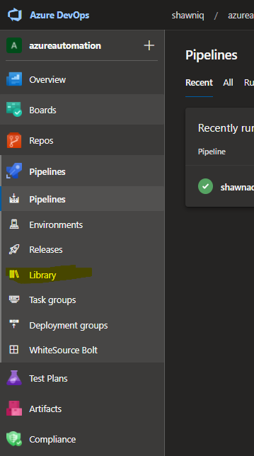
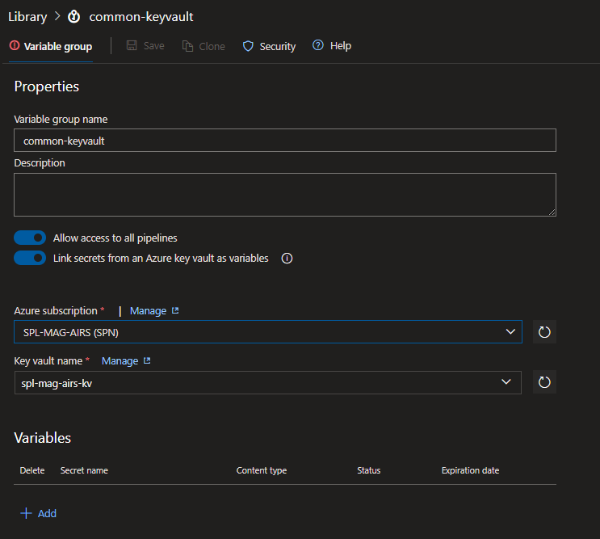
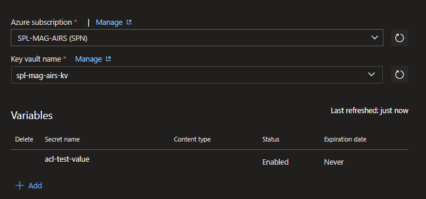
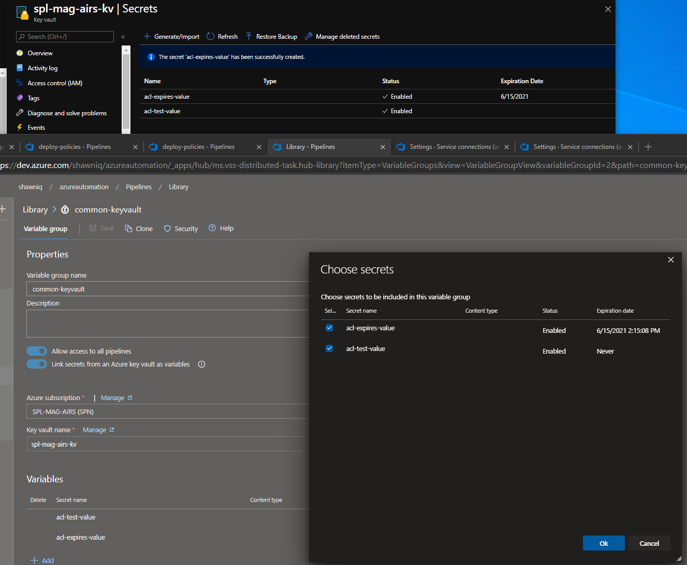

# Azure Key Vault

While many teams / organizations will place their secrets in Build / Release pipelines I find this very frustrating in terms of policies.  

- Do the teams keep the secrets in plain text?  
- Do the teams have to replicate these variables across many pipelines?
- When a key changes, how does the development team receive a notification?
- What is the rotation policy on any of those secrets?

To address this issue I highly recommend variable groups and integration with a Key Vault.
Service Connection `Variable Groups`
Secrets, Passwords, can be stored in encrypted variables but a **_better_** option is to create an Azure Key Vault and store your secrets in a rotating store.

A prerequisite for these steps is to have generated a Service Principal above.

1. Navigate to Azure
1. Create a Key Vault
1. Associate the Service Principal we created earlier with **Secret Permissions** [Get, List]

    

1. Create a _Secret_

    

1. Use Azure DevOps Pipeline libraries *click Libraries*

    

1. Create a new Variable Group *common-keyvault*

    

1. Enable 'Link secrets from an Azure key vault as variables'
1. Choose the Azure subscription service principal we've already configured.
1. If you've selected the correct SPN it should be able to find the Key Vault we created in step 2.

    

1. You can name the group 'common-keyvault' to identify it as reusable variables
1. Now click '+ Add' and it will query the secrets in the Vault

    

1. Select a Key Vault secret _Notice the expiration if specified in the Key Vault_

    

1. Revievw the Expiration dates which will include their values being pulled in DevOps pipelines.

    

Now we can use "Key Vault" secrets in our pipelines natively and gain the strength of rolling values and expirable values.

&nbsp;

## Return to main article

[Main article](./readme.md)
