# Azure DevOps Build Pipeline ***Classic***

Navigate to pipelines and let's create a *new* pipeline.

1. Click 'New pipeline'

    

1. Choose the 'Classic Editor' **The next outline will cover a yaml file**

    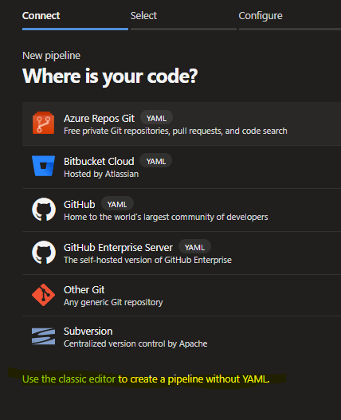

1. If your code was cloned into DevOps or you want to run it from DevOps select your Project and Repo

    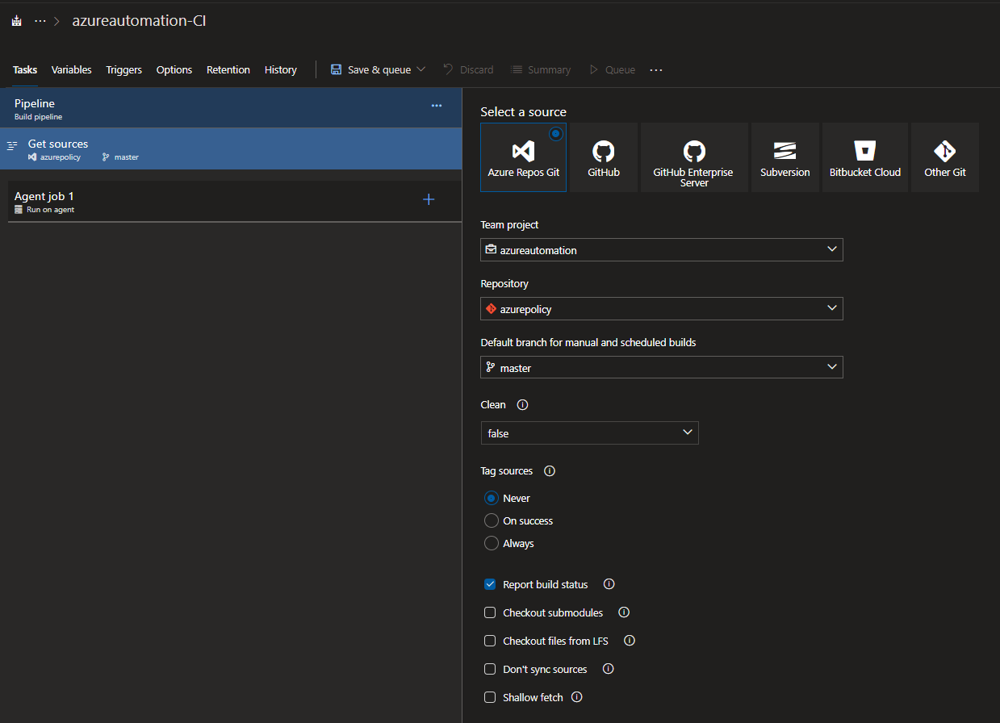

1. For this demo I'm going to select GitHub.  

    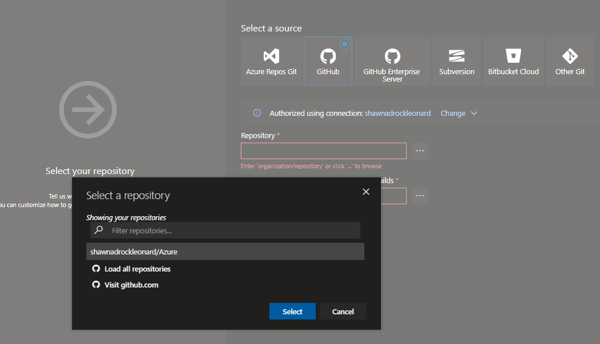

1. Note: ***I've previously authenticated to GitHub so shawnadrockleonard/azure appears.  You'll want to create a new service connection***

    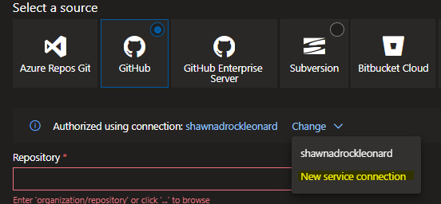

1. Note: ***Once you have a service connection you can browse for your repos and target a specific branch*** then click 'Continue'

    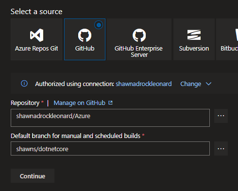

1. We are using a 'Classic' pipeline so on the next step choose 'Empty job'

    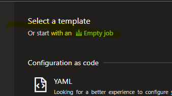

1. Pipeline (use the default) and give it a name '*organization*-CI'

    

1. Link to your existing Variables groups created earlier

    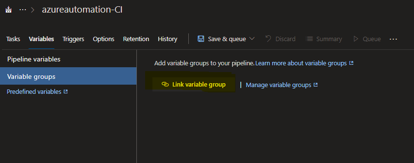

1. Select the variable group we created earlier 'common-keyvault'

    

1. The list of variables we selected in the 'Library' steps are now available in the pipeline

    

1. Let's rename the 'Run on agent' Agent job to 'Test policy and Initiative Definitions'
1. Then click the '+' on the Agent job to add a tasks 'Powershell'

    

1. We will leave 'File path' selected.  As we've connected to this repo in the service connection when i click the elipse I'll navigate to the source code.  I've included a powershell script [Get-ArtifactsFeedName.ps1](.\policies\Get-ArtifactsFeedName.ps1)

    

1. This particular script has a dependency on a variable 'ArtifactsFeedName' as well as a System variable.  To find the 'ArtifactsFeedName' navigate to the Artifact feed as we did when originally configuring the feed.

    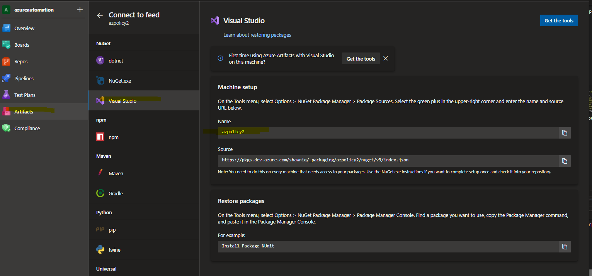

1. We need to set to our newly created Artifact Feed name as a pipeline variables.

    

1. Then lets update the Task "Arguments" with the appropriate values. -ArtifactsFeedName "$(ArtifactsFeedName)" -TeamFoundationUri "$(System.TeamFoundationCollectionUri)"

    

1. In previous steps we added '*project* Build Service (*org*)' with permissions to Read the Artifact Feed.  We need to allow the authentication/handshake to enable connectivity. Navigate to 'Tasks' and click on the Agent job then check the box 'Allow scripts to access the OAuth token'

    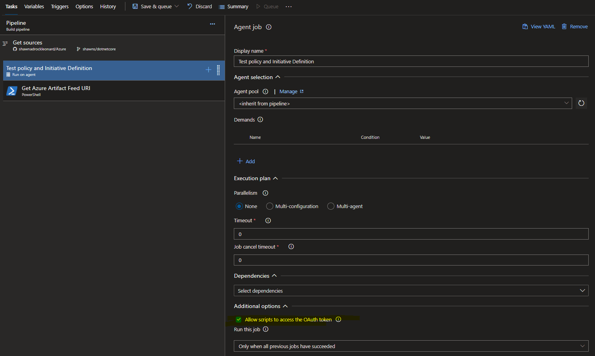

1. Save and Queue the build to validate our Pipeline

    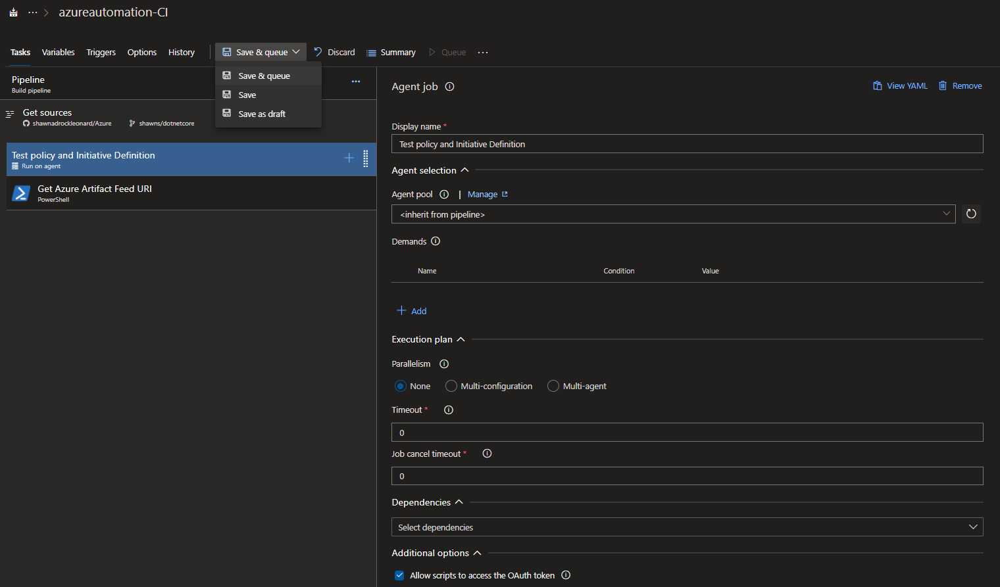

1. Add a comment, leave the defaults, then click 'Save and Run'

    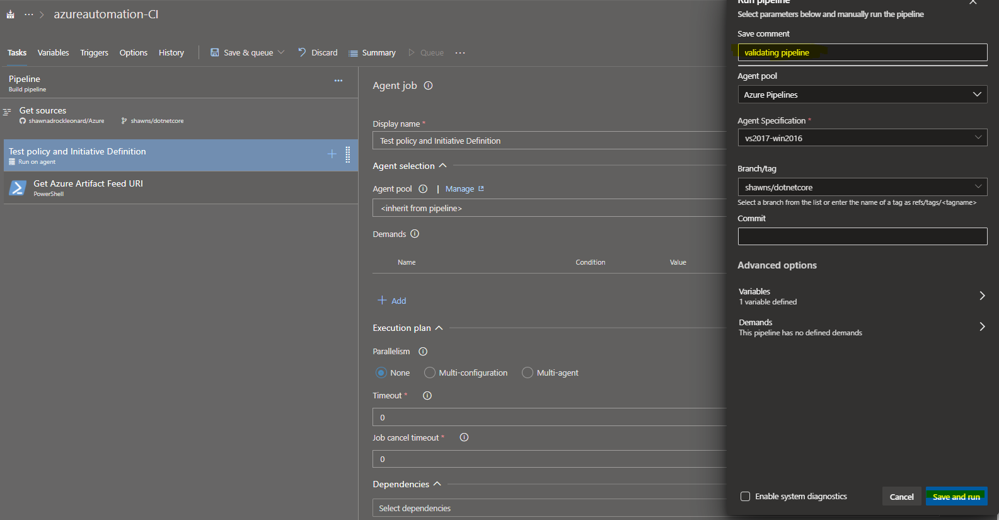

1. The pipeline is queued and awaiting a Microsoft hosted agent.

    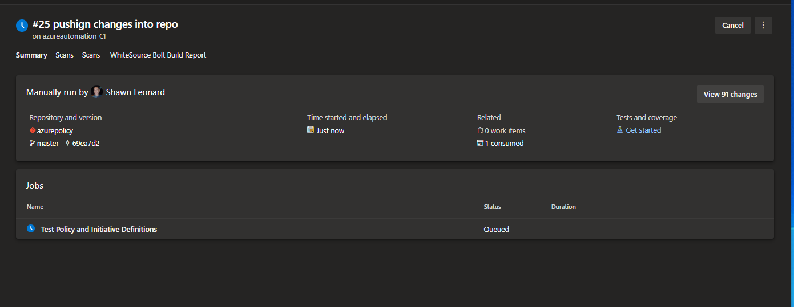

1. Review the pipeline run log and validate each task/step

    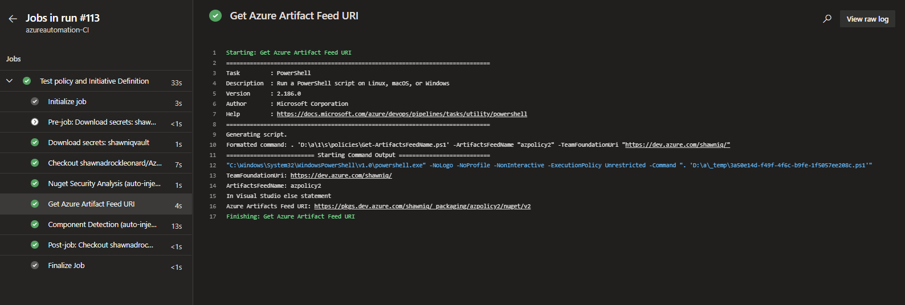

1. Take notice of the 'Download secrets' task which allows variables to exist in the pipeline.
1. In the 'Get Azure Artifact Feed URI' we can see a successful parsing of variables and emitted output to the screen.
1. The powershell script writes a pipeline variable 'feedURI' to output.  We need to create an empty variable into which it can be stored.

    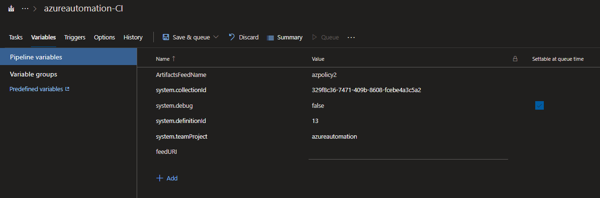

&nbsp;

## Return to main article

[Main article](./readme.md)
