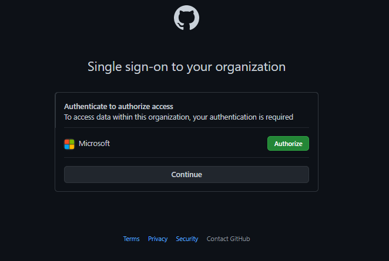
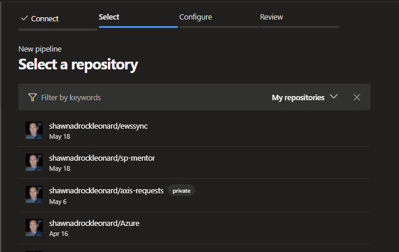
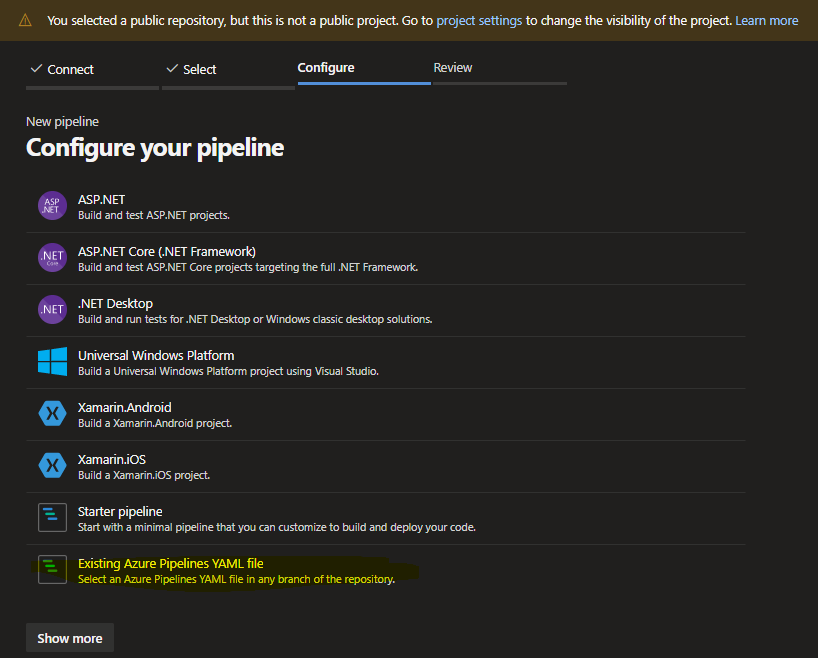

# Azure DevOps Build Pipeline ***YAML***

Navigate to pipelines and let's create a *new* pipeline.  For the following example I'm using this repositories 'azure-pipelines.yml' file to build the policy objects.  [azure-pipelines.yml](https://github.com/shawnadrockleonard/Azure/blob/shawns/dotnetcore/azure-pipelines.yml)

&nbsp;

1. Click 'New pipeline'

    
1. Choose the 'Classic Editor' **The next outline will cover a yaml file**

    
1. If you belong to a controlled Organization you may have to authorize the connection.

    
1. Once you authenticate you can pick the repository in GitHub

    

1. I'm going to filter to find the repo from which a build pipeline will be connected and enjoy continous integration.

    

1. Note: ***a banner may present public/private conflicts at the top** A private DevOps repository can not present a status badge in GitHub.

    

1. We want to use an existing YAML file which is included in this Repository.  Select 'Existing Azure Pieplines YAML file'

    

1. As I developed this series of notes I kept everything in a branch.  You may want to keep everything in your 'main' or 'default' branch.  For this series of screenshots I chose 'shawns/dotnetcore'.  Once I selected the branch I could choose from the drop-down a series of discovered YAML files.  

    

1. The next step is a review of the YAML file.  Notice all of the defined YAML stages/jobs/steps are included in the preview.   In the YAML file I've included variable groups I want to read from including 'common-keyvault' which we previously configured in the Key Vault steps.  ***However, In this YAML file I've called out several 'Variables' which need to be defined before we can proceed.***  Click the 'Variables' to add 4 variables.

    

1. Create 4 'Variables'.  Click the 'New variable' to create the 1st variable then a '+' icon for all other ones.  Make sure the values match up with your Azure DevOps and Azure subscription environment.  Fill in the following:
    - ArtifactsFeedName: the value will be the Artifact Feed you created in Step 1
    - ArtifactsModuleName: 'AzTestPolicy' is the nuget package we uploaded in Step 1
    - ArtifactsURI: You can copy this value from your Artifact Feed.  While your artifact feed url includes v3/index.json this URL must be the nuget/v2 endpoint. EX: [https://pkgs.dev.azure.com/*org*/_packaging/*feedname*/nuget/v2](https://pkgs.dev.azure.com/*org*/_packaging/*feedname*/nuget/v2)
    - SubscriptionId: This is the GUID for your Azure Subscription

    

1. Now we can click 'Run' and watch our pipeline build with its results.

    

1. The first time this runs Azure will validate the build and ensure it has access to everything it will connect to.  We need to address any permissions for the pipeline.  Click 'View'

    

1. Here I'm reusing a service connection to Azure.  I did not initially grant the 'Service connection' access to all pipeline nor all pipelines access to the Service Connection.  I must 'Permit' this connection 'sharing' before I can proceed.  Click 'Permit'.

    

1. Confirmation dialog.

    

1. With little to no configuration we can now review the logs and validate success to include the produced Artifacts.  We could expand this YAML file to release to Azure via other Build-In tasks but our next step is to create the release pipeline.

    

1. Clicking on "1 published" which are the Build artifacts we can review all of the templates, definitions, and powershell files which are available to download and or use in a Release pipeline.

    

&nbsp;

## Return to main article

[Main article](./readme.md#step-05-azure-devops-release-pipeline-with-gated-deployment)
