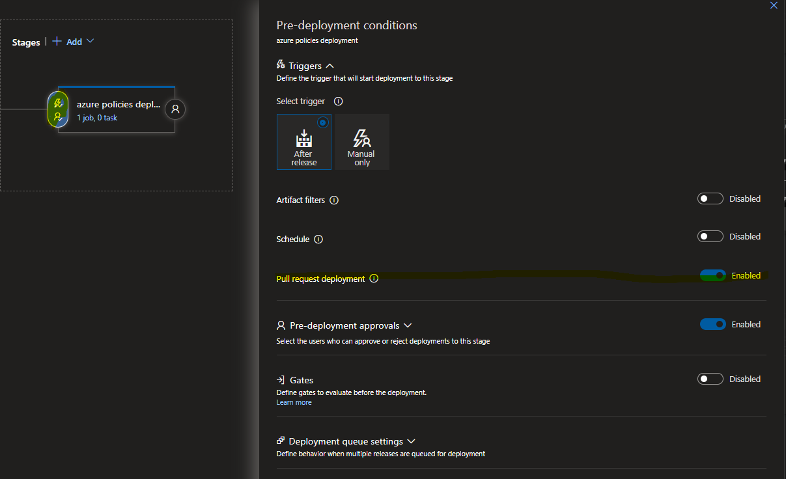
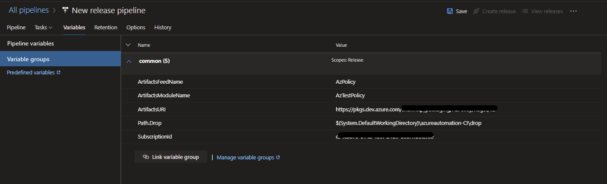

# Azure DevOps Release Pipeline (with gated deployment)

Release pipelines may not be what every developer advocates.  They may prefer to put 'Continous Deployment' in the YAML file.  However, Azure Releases have tremendous power to include authorization, validation, workflow, status, build retention, and issue tracking all out of the box (OOTB).

Navigate to Pipelines > Releases and let's create a *new* pipeline.

1. Click the drop-down "New" and choose 'New release pipeline'

    

    ***Note: we can export release pipelines as JSON and Import them***

1. Upon entering the 'new' pipeline we can choose to start from a template which adds task groups and tasks based on publically available templates.  We will choose the 'Empty job' as we are going to simply run an Azure Powershell command.

    

1. Let's call the stage 'azure policies deployment'.  With support for multiple stages we could make this more descriptive and deploy to many subscriptions. 

    

1. We need to add an artifact.  Not to be confused with our 'Repository Artifacts'.  The artifacts we are selecting in this screen are our build artifacts published by build pipelines.  We are going to select the build pipeline we created based on YAML.  Then click 'Add'

    - Project: choose azureautomation as this is the repository into which we are deploying code or creating the build pipelines.
    - Source (build pipeline): The drop-down will contain all 'Build' pipelines.  We previously named mine 'shawnadrockleonard.Azure' which was generated on our behalf by using GitHub YAML.
    - Default Version: This is a great option, it can be a specific branch, a specific version, a specific tag on a build, or Latest.  
    - Source Alias: The name we enter here will be a reference variable later in our release tasks.

        

1. Once we've picked our artifacts (which can be from multiple repositories and any build pipeline) we can set the schedule / triggers.

    

1. Click on 'Schedule not set' to launch the various scheduled triggers screen.  Note: This would enable a specific workflow such as 'Deploy the latest on Friday @ 9PM'.   The release would include all successful builds and versions prior to Friday @ 9PM.  

    

    ***We are NOT going to set a schedule***

1. We are going to click on the lighting bolt icon with a person below it which represents our 'Pre-deployment conditions'.    For our example we are going to set 'After release' 

    

1. In our 'After release' settings we are going to require an Approver.  This individual will receive an email to approve the release and must click approve before it can be released.  This could target specific 'Engineers' or 'Infrastructure' individuals or a Group.   The level of granular control can prevent a single person from changing code and subsequently releasing it.  

    

1. With our current configuration this pipeline will require a manual release.  Click on the artifact lighting bolt if you want to enable automatic release creation.  There are a variety of options but for this example we will enable a Pull request to the 'main' or 'default' branch in GitHub.

    - Anytime there is a Pull Request 'PR'
    - Anytime the Build pipeline runs successfully.

    

1. We updated our Artifact triggers so let us go back and update the stage 'azure policies deployment' to enable a PR based deployment.

    - Click the lighting bolt 'Pre-deployment condiitions'
    - Flip the toggle for Pull request deployment

    

1. Now that we've toggled the Pull request deployment trigger our 'Continous deployment trigger' indicates we are good to go.

    

1. In the stages click the hyperlink '1 job, 0 task' to we can define some tasks for the release pipeline.

    - Rename the Agent Job to 'deploy policy definitions'
    - Agent Specification: Choose 'windows-2019'.  
        - For a list of capabilities for each agent see: [Microsoft-hosted agents](https://docs.microsoft.com/en-us/azure/devops/pipelines/agents/hosted?view=azure-devops&tabs=yaml)
    - Artifact download: ensure Latest and 'drop' is checked.
    - Check the box 'Allow scripts to access OAuth token'

    

1. Now add an 'Azure Powershell' task to the stage.

    

1. Configure the powershell task:
    - Rename the display to 'deploy vm schedule policies'
    - Click the drop-down for Azure subscription and select 'Available Azure Service connections' and pick the SPN we configured in Step 02

    

    - Keep 'Script file path' and browse to the powershell file 'deploy-policyDef.ps1'  
        - ***I previously named my artifact 'YamlAzureArtifacts' so the value here is '$(System.DefaultWorkingDirectory)/YamlAzureArtifacts/drop/deploy-policyDef.ps1'***
    - Script arguments should be: -definitionFile "$(System.DefaultWorkingDirectory)/YamlAzureArtifacts/drop/policy-definitions/deploy-vm-shutdown-schedule/azurepolicy.json" -subscriptionId "$(SubscriptionId)" -silent
    - Choose 'Latest installed version' of PowerShell as Policy modules are available in later modules
    - Expand Advanced and check the box for 'Use PowerShell Core'

    

1. Note: I Have some variables defined in the 'Configure the powershell task'.  Because I'm reusing variable groups I can take advantage of the variable groups we defined in the Build pipeline by linking them.

    

    - A very handy feature, if you have multiple stages defined you can scope the variables to a stage.  This enables you to override a value for a different stage.  In this scenario I've defined a $(SubscriptionId) variable but in a separate stage I may want to target a different subscription Id.  Using scoping I could switch the value at deployment time.

    

    - Now I have variables available to both my build and release pipelines.  To include potentially reusing Key Vault secrets such as a password to be used in ARM template deployments.

    

1. Name the pipeline and let's create a release.  

    - Will name our pipeline 'deploy-policies' by clicking the pencil icon next to the title.

    

    ***I added an Azure CLI task but disabled it to show you can have tasks in pre-development***

1. Click the 'Create release' and a flyout will appear.  You can review the stages and the build artifacts which will be used in the release.
    - Note the build artifact number.  Each release is associated with a Build and those artifacts.
    - Lets test the deployment and approval process.

    

1. My first series of releases failed in this pipeline as I originally built it.  Then on Release-9 success.  Let's show 2 versions a failure and a success.  To switch between the two attempts you can click on the drop-down caret near the 'Deployment attempt #'

    - Failure: 'Release-8 Attempt #1'

        
    ***My service principal doesn't have the authorization to write policies***

    - Success: 'Release-8 Attempt #2'

        
    ***Success after I provided the service principal with the role 'Resource Policy Contributor'***

1. Reviewing the role authorization in the Azure subscription.

    - Failure: 'Release-8 Attempt #1'

        

    - Success: 'Release-8 Attempt #2'

        

&nbsp;

## Summary

Azure DevOps release unless imported from a working pipeline will require rework.  There is version history associated with each release modification with the ability to compare or revert.  This is a fantastic feature which can help restore a release to a working version.  

In our example we implemented an approval workflow.  The below screenshot demonstrates the history of a release which includes timestamps, initiator, approver, and the build artifacts used in the deployment.

This provides a tremendous about of oversight into what is built, how it is controlled, and how it can be enabled for integration and compliance controls.  In our next step we will review Policy Definitions and Compliance.

&nbsp;

## Return to main article

[Main article](./readme.md#step-06-review-azure-deployment-and-compliance)
