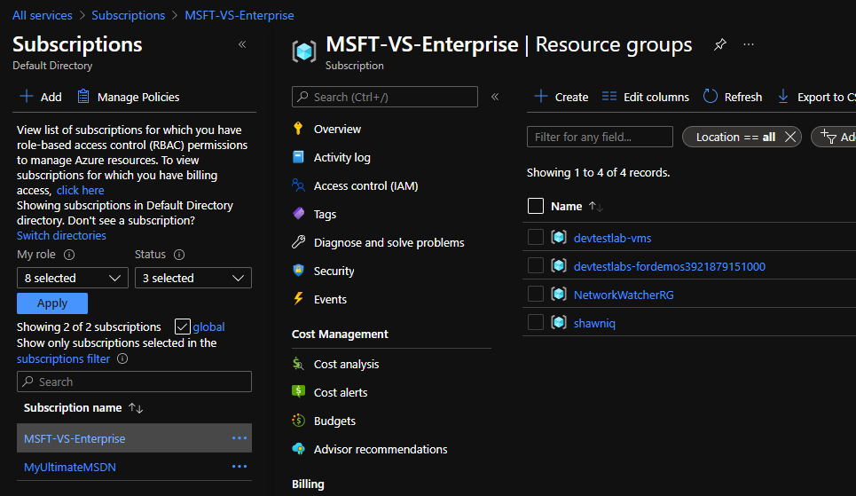

# Review Azure deployment and compliance

Azure is powerful.  You can enable workflows and concepts that were unphatomable a decade ago.  With that power and capability comes waste and an unscripted usage of resources.  Every organization has the power to assist developers while maintaining structure, compliance, and order.  With Policies you can claim the best of both worlds.

&nbsp;

## Initial configuration

Prior to executing steps 1 - 5 in this tutorial my brand new subscription had no policies or resources configured or created.  Prior to releasing the policy definitions I performed a few activities.

1. Create a [management group](https://docs.microsoft.com/en-us/azure/governance/management-groups/create-management-group-portal) and associate the subscription with the management group.

    

1. Associate users, managed identities, and service principals with the management group

    

1. Create a resource group, in the resource group created a DevTest lab, and in the DevTest lab I created a Virtual machine with no 'Shutdown schedule'.   This was by design as I wanted to deploy the 'deploy-vm-shutdown-schedule' policy definition.  

    

1. I added the service principal created in Step 02 to the subscription 'Access Control' role assignments as contributor.  For 'Policy Defintions' I would typically create multiple SPN's to have specific functionality.  For this demo I allowed the SPN to deploy policies and create resources.  

    

1. I did not add the role assignment 'Resource Policy Contributor' until after the release.  I only did this to demonstrate Role Based Access Controls.  That while you can create an SPN and it can have some permissions/authorization in Azure.  It can't perform any activity for which it was not given specific authorization.

&nbsp;

## Azure Policy

The Azure Policy dashboard enabling an overview of all of your resources, the current state of compliance, and deployed policies in a single pane.  To navigate to 'Policies' you can:

1. Subscription:
    - Find your subscription (then filter settings for 'Pol')

        

    - Click on the 'Policies' settings navigation

        

1. Policy navigation:
    - Click on 'All services', search for Policy, and then pin Policy to your navigation

        

    - Navigate to the Policy blade.  There is a scope box at the top that allows you to toggle between subscriptions.

        

&nbsp;

## Azure Policy (definitions deployed via DevOps)

There are many Built-In policies in Azure based on best practices, open-source communities, and general security standards.  Because we used Az DevOps to deploy a policy definition we have a new 'Type' = Custom.  In the screenshot I filtered based on Custom to see our new Policy.  Note: ***it is scoped to the subscription we targeted in the Release pipeline***

This particular policy does not have a current assignment.  It is deployed but not active.  Note the JSON markup for the definition.  Also, of note is the 'Available Effects' that it will 'DeployIfNotExists'.   This particular definition when assigned will find Non-Compliant machines and add a ARM based template to the machine thus enacting a 'Shutdown schedule'.  

&nbsp;

## Azure Policy assignment (enables compliance and monitoring)

We will click 'Assign' in the menu and fill in some values through the various tabs.

1. Basics
    - Specify the subscription; 
    - Exclusions (used if you want the policy to NOT apply to a resource group or a specific resource like a Domain Controller in this example)
    - Leave everything else defaulted

    

1. Parameters (the definition exposed a few parameters include data types and potential values)
    - Set the shutdown time
    - Pick a Time Zone ID
    - Change 'Send notification before auto-shutdown' to Enabled
    - Fill in an individual or a group distribution.  EX: My Microsoft Team internal channel that Infrastructure folks can monitor

    

1. Remediation (this is disabled by default)
    - Check the box to create a remediation task
    - Pick the policy
    - The remaining options per this policy definition are pre-filled.

    

1. Non-compliance messages (great for notification prompts)
    - Leave textbox empty

    

1. Review + create
    - Review the details and click 'Create'

    

1. Result after clicking create.  
    - A number of backend tasks were generated.  You can open the Notification modal to validate.

    

1. Switch to the Policy | Assignments
    - In this pane you can view assignments.

    

1. Click on 'View compliance' to view the results of the task.

    

&nbsp;

## Azure Policy | Compliance blade

Navigating to the Policy blade we can see the new assignment and its related compliance score.  In this particular case the job to evaluate compliance has not yet started.  After it runs we will view the number of Virtual Machines that are Non-Compliant and their resolution status.

After waiting a few minutes the results were as expected.  My 1 machine was flagged for being non-compliant and the policy engine attempted to deploy the policy remediation task.  

What I expected.  I expected the remediation task to ensure my Virtual Machine was compliant.  However, In this particular case the remediation task failed.  Failure isn't a bad thing here.  What I learned is that my DevTest Lab Virtual Machine is controlled by 'Az DevTest Labs' compliance controls which, honestly, was what I expected.  If I had a normal virtual machine the ARM template would have been applied and my Non DevTest lab VM would be setup to shutdown at 0300 UTC.   From this I can modify the assignment to "Exclude" resource groups which contain DevTest Lab environments.  

## Summary

I have much to learn about Policy and Compliance.  I did, however, learn and implement deployment from GitHub, Az DevOps, and expanded RBAC knowledge.  I hope you find the tutorial a step by step approach.  Please feel free to issue a PR to fix anything.

&nbsp;

## Return to main article

[Main article](./readme.md)
