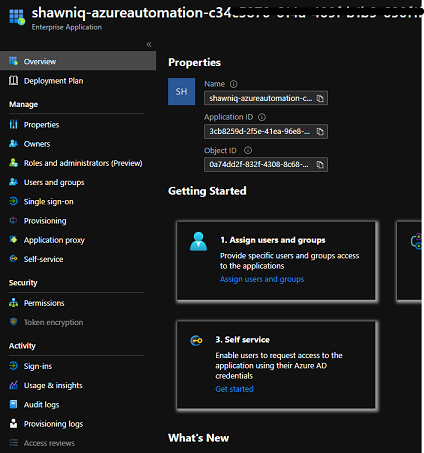
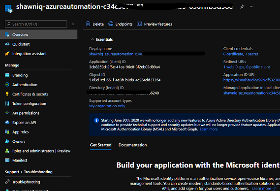
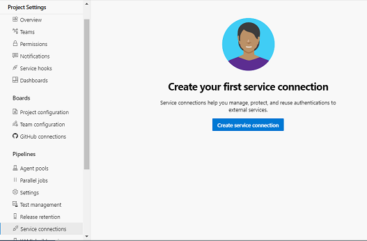
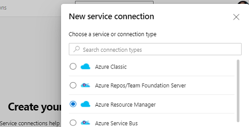
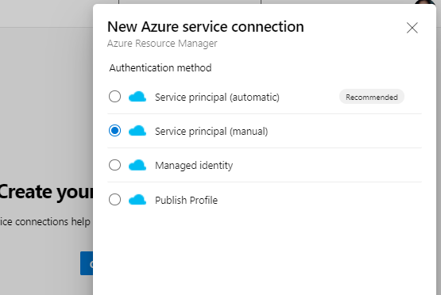
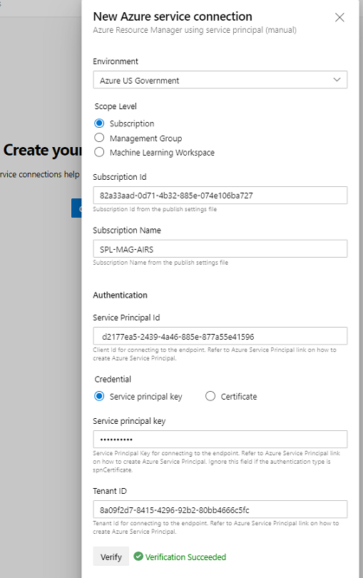
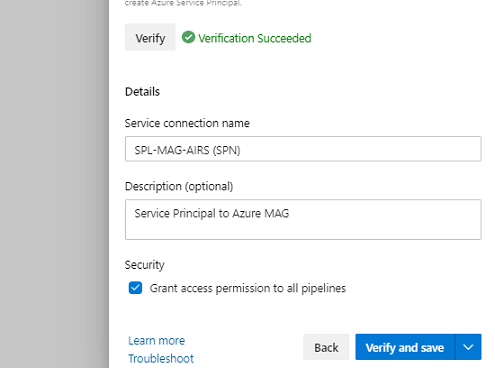
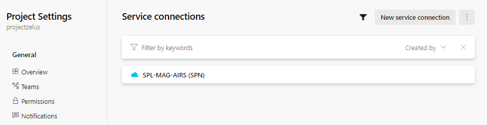

# Azure Service Principals

Azure service principals (SPNs) are intregral to many deployments and management scenarios for Azure.  
This particular scriptlet is designed to automate the creation of an SPN for Azure DevOps.  
*However, this scriptlet can be used to create any SPN for future use.*

[[_TOC_]]

## Executing the script

```powershell
# This will be your initial 'Secret' in the App Registration
$securepassword = ConvertTo-SecureString -String "<a secure password>" -AsPlainText -Force 

# Executing the scriptlet from the command line
.\scripts\AzServicePrincipals\Create-AzADServicePrincipal.ps1 `
    -subscriptionName "<Your Az Subscription Name>" `
    -password $securepassword `
    -spnRole contributor `  # Will associate the Role in Azure to the SPN
    -environmentName AzureUSGovernment ` # Default is Commercial
    -Verbose  # Increased log output

# The execution will emit the following:
# Copy and Paste below values for Service Connection
# ***************************************************************************
Connection Name: (SPN)
Environment:
Subscription Id:
Subscription Name:
Service Principal Id:
Service Principal key: <Password that you typed in>
Tenant Id:
# ***************************************************************************
```

```powershell
# Query Azure AD

# Note: The script will create an application with the naming convention 'AzDevOps.{0}.{1}' 0 = Username; 1 = Guid.New
Get-AzAdApplication -DisplayNameStartWith "AzDevOps."
```

### Result of the script

After you run the scriptlet you'll have a new "Enterprise App" in Azure.  The output of the scriptlet "Service Principal Id" is the "Application ID".  This value will be used in the manual configuration for the "Service Principal Id".  The output of the create svc principal scriptlet will be 1 application with 2 components (Enterprise Application and an App Registration)

The Enterprise Application:

- 

Azure AD Application Registration.  In this area you will maintain 'Certificate & secret' keys which can be used for authentication.  An initial secret is created on your behalf during the scriptlet.

- 

## Azure DevOps Labs

A conveniently published series of screenshots is available on DevOps Labs
[https://azuredevopslabs.com/labs/devopsserver/azureserviceprincipal/](Azure DevOps Service Principal)

## Azure DevOps Manual configuration

For Azure Government, Azure Germany, Azure China you'll need to connect a service connection via Manual steps.  Please run the powershell script identified above.  Capture the output from the script.  I tend to store the secrets in an Azure Key Vault for safe keeping.  You'll use those settings in these manual configuration steps.   Included below are the steps to connect your new SPN.

### Screenshots for connecting the SPN in Az DevOps 'Service Connections'

1; Create service connection

- 

2; Choose connection type 'Azure Resource Manager'

- 

3; \*\*\* if this is NOT Azure Commercial; choose `Service Principal (manual)`

- 

4; Enter service connection details from the powershell script output **_Ex: Azure Government_** then click Verify

- 

5; Enter a name for your service connection

- 

6; Service connections list

- 
