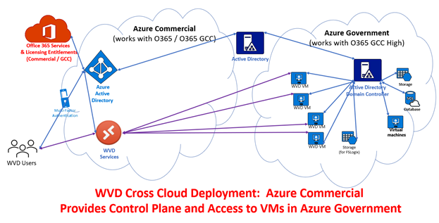

# WVD Cross Cloud / Subscription Provisioning - Configuration Walkthrough

## Contents

- Overview	1
- Typical WVD Deployment	2
- Challenge:  Separate Clouds Complicates Deployment	2
- Cross Cloud / Cross Subscription Deployment	4
- Deployment Process	6
- Create Empty Target Pool in Azure Commercial (~2 minutes)	6
- Create Full Source Pool in Azure Government (~20 minutes w/VM provisioning)	8
- Register VMs with Target Pool with PowerShell (~5 minutes)	11
- Required Information	11
- Install WVD Azure PowerShell Module	12
- Retrieve Target Host Pool Token	12
- Create Script to Inject into VMs to Unregister / Reregister	12
- Retrieve Source Host Pool VMs and Reconfigure	13
- Setup Process Results	13
- Identified Limitations (The Downside)	15
- Monitoring	15
- Power Management / Compute Optimization	15
- Other Maintenance (Pool Expansion)	15

## Overview
Thousands of Microsoft U.S. government and regulated industry customers use the Office 365 Government Community Cloud (GCC) for end-user identity and productivity services.  Azure Active Directory (AAD) for the GCC lives in a U.S.-only partition of AAD in the Azure Commercial service.

Many governmental agencies leverage Azure Government for non-Office 365 services, which cannot directly leverage the AAD identities of GCC users.  

This document is intended to demonstrate how Windows Virtual Desktop (WVD) might be deployed using Azure Commercial as the control plane, and Azure Government for compute.  Such a deployment enables seamless access for GCC user identities while maintaining data sovereignty inside the Azure Government environment, with additional administrative burden.

Please note that while the Windows Virtual Desktop (WVD) service has received FedRAMP High accreditation in Azure Commercial and (expected soon in) Azure Government, **this cross-cloud topology and deployment method has not undergone the rigorous review required to validate it as a supported offering**.  Customers requiring support, or who desire compliance with CJIS, IRS-1075, or other standards should investigate implications of this method. 
The techniques and considerations shown may also **apply to cross-subscription / cross-tenant deployments**, but those scenarios will not be detailed.

## Typical WVD Deployment
A typical Azure Windows Virtual Desktop deployment would be configured within a single Azure subscription, and leverage Azure Active Directory (AAD) synchronized to Active Directory – with WVD host pool VMs joined to the Active Directory Domain Services (AADS – or simply AD), as shown here:
 
WVD (and other services) relies on user identities in AAD being connected to ADDS to provide access to resources.  

### Challenge:  Separate Clouds Complicates Deployment
While Microsoft recommends customers adopt a one cloud approach for the full seamless experience across all Microsoft cloud services, often business requirements force consumption of multiple clouds – including Sovereign Clouds available in Azure (US Government, China, and Germany).  Separate cloud deployments may complicate identity access across clouds, where regulatory or technical requirements have mandated a separation of identity.  

The need for U.S. governmental agencies to meet Criminal Justice Information Services ([CJIS](https://docs.microsoft.com/en-us/microsoft-365/compliance/offering-cjis?view=o365-worldwide)), [IRS 1075](https://docs.microsoft.com/en-us/microsoft-365/compliance/offering-irs-1075?view=o365-worldwide), or other compliance bars (including Department of Defense [Impact Level 4 and higher](https://docs.microsoft.com/en-us/microsoft-365/compliance/offering-dod-disa-l2-l4-l5?view=o365-worldwide))  has pushed law enforcement related and revenue responsible agencies toward Azure Government for the hosting of data and services.  Many of these agencies have procured and deployed Office 365 using Microsoft [Government Community Cloud (GCC)](https://docs.microsoft.com/en-us/office365/servicedescriptions/office-365-platform-service-description/office-365-us-government/gcc) offering, which ensures data will be stored within the continental United States.  
Office 365 GCC utilizes Azure Active Directory (AAD) within the Azure Commercial infrastructure and identities within Azure Commercial cannot be used to directly access service in Azure Government.  Azure Government uses separate and distinct infrastructure (including Azure Active Directory) to provide services, as detailed [here](https://docs.microsoft.com/en-us/azure/azure-government/compare-azure-government-global-azure).  While O365 GCC agencies have AAD tenants in Azure Government, they are commonly only populated with administrator credentials for “fabric” management without, access to O365 license benefits in the O365 GCC tenant.

[]
 
For WVD in particular, Azure Active Directory (AAD) serves to manage access to WVD published resources for end users by providing authentication and access to applications and desktops enabled for their AAD identities.

Users and groups are granted access to WVD services through the assignment of their identities to Application Pools (via the role assignment “Desktop Virtualization User”) and later authenticated in the VM hosting the resource using their connected Active Directory credential. 

Typical deployments of WVD require:
•	Azure Active Directory synchronized with Active Directory Domain Services (AD) or AADDS
•	Active Directory Domain Services available in Azure (for machine join and profile management)
•	Microsoft 365 licensing entitlements to support the use of Windows 10 Enterprise as well as key desired security features (example:  Conditional Access)

The dependency upon integrated Azure AD / AD for WVD deployments can be easily met by many customers, however Microsoft customers who have deployed in Microsoft national (sovereign) clouds face significant complications and may appear to be blocked from deploying WVD and other Azure services (including AD integrated Azure Files, for example).

Solutions to synchronize identities and federate cross cloud may be an option, but complicate integration and may require additional licensing for additional (duplicate) identities – those options are not detailed here.

Instead the approach could be to use the existing identity and WVD core services in Azure Commercial, connected to provisioned compute in Azure Government:

[]
 
This approach can provide seamless access to end-users (same login experience they would have for Office 365 resources) with desktop and application services inside Azure Government, near existing data assets.
Cross Cloud / Cross Subscription Deployment
A WVD deployment which crosses cloud / subscription boundaries has the same high-level requirements of a typical deployment:
•	Azure Active Directory synchronized with Active Directory Domain Services (AD) or AADDS
•	Active Directory Domain Services available in Azure (for machine join and profile management)
•	Microsoft 365 licensing entitlements to support the use of Windows 10 Enterprise as well as key desired security features (example:  Conditional Access)

The proposed process to create a cross cloud / cross subscription deployment takes advantage of the fact that VMs in Host Pools do not need to live within the subscription where the host pool is defined – the VMs have the ability to be manually registered the host pool to provide session access even if they are in another cloud.  Detail on how to manually attach a VM to a WVD host pool can be found here:  [https://docs.microsoft.com/en-us/azure/virtual-desktop/create-host-pools-powershell#prepare-the-virtual-machines-for-windows-virtual-desktop-agent-installations](https://docs.microsoft.com/en-us/azure/virtual-desktop/create-host-pools-powershell#prepare-the-virtual-machines-for-windows-virtual-desktop-agent-installations) . 

## Deployment Process

Since WVD is available in Azure Commercial and Azure Government, testing the process is simplified by using the Azure Portal in both environments to prepare the infrastructure, as well as leveraging a small bit of PowerShell automation to finish the process.  The High-level steps are:
1. Create empty (target) WVD Host Pool in Azure Commercial 
(subscription with AAD access) 

2. Create (source) WVD host pool with Session Hosts in Azure Gov 
(subscription without AAD access, but with AD Domain Controller line of sight)

3. Connect Session to with “target” Host Pool
    1.	Get WVD host pool token from target Host Pool
    2.	Unregister VM from Source host pool
    3.	Register VMs with target host pool

Details of the process are outlined below.

### Create Empty Target Pool in Azure Commercial (~2 minutes)

Create an empty host pool in the cloud->tenant->subscription which has access to the end user Azure Active Directory:  

[]

[]
 
**Note: DO NOT CREATE ANY VMs in this pool.**
 

### Create Full Source Pool in Azure Government (~20 minutes w/VM provisioning)
Log into the Azure environment that will host your session host (the other cloud->tenant->subscription which does not have access to AAD, but which does have line of sight to an Active Directory Domain Controller connected to that AAD).
Create this host with VMs: 

[]
 
This time, select the option to create VMs:
 
 
 

Register VMs with Target Pool with PowerShell (~5 minutes)
Once the target (empty) and source (full) pools are created, connecting the session hosts created in the “source” (Gov) Host Pool with the “target” (Commercial) Host Pool is a straightforward process of unregistering and reregistering the WVD Agent.
To simply the process, PowerShell is detailed below which can be used to automate the process. Filling in a hand full of variables (host Pool names, subscription IDs, and resource group names) and then executing the code / signing into each Azure environment is all that is needed.
The sample code is provided in its entirety here: 
  
…with the following document section being a walkthrough / commentary on the code.
Required Information
Other than properly permissioned credentials for each cloud->tenant->subscription, only the following information is required to run the code (need to update with your deployment specific information):
#################################
# Azure Settings & other parms
#################################
$GovResourceGroup 	= "GBBComm"
$GovSubscriptionID	= "11111111-1111-1111-1111-111111111111”
$GovHostPool		= "Commercial"	
$CommResourceGroup 	= "kelbleyWVD"
$CommSubscriptionID	= "22222222-2222-2222-2222-222222222222”
$CommHostPool		= "Gov"	
 
Install WVD Azure PowerShell Module
If you do not have it already, you will need the Azure WVD PowerShell Module (as well as other Azure-related modules to connect to Azure and manipulate the VMs):
#################################
#Step 0 - Install WVD Module... in case you don't have it
#################################
# Install-Module -Name Az.DesktopVirtualization
Retrieve Target Host Pool Token 
Log into the cloud->tenant->subscription with AAD access, and retrieve the token required to join VMs to the deployment:
#################################
#Step 1 - Connect to Azure Commercial and retrieve Commercial Host Pool Token
#################################
Connect-AzAccount 
Select-AzSubscription -SubscriptionId $CommSubscriptionID
$CommPool = Get-AzWvdRegistrationInfo -ResourceGroupName $CommResourceGroup -HostPoolName $CommHostPool
$Token = $CommPool.Token
Create Script to Inject into VMs to Unregister / Reregister
Save a custom .PS1 file on your local host which includes the necessary host pool token, with all necessary commands to unregister and reregister the VM to the target host pool.  The file will be executed later in the code in each VM:
#################################
#Step 2 - Build Command to run in VMs
#################################
$remoteCommand =
@"
#### Run Unregister from Gov Pool / Reregister with Commercial Pool
Stop-Service RDAgentBootLoader
Set-ItemProperty -Path 'HKLM:\SOFTWARE\Microsoft\RDInfraAgent' IsRegistered -Value 0
Set-ItemProperty -Path 'HKLM:\SOFTWARE\Microsoft\RDInfraAgent' RegistrationToken -Value $Token
Start-Service RDAgentBootLoader
Get-ItemProperty -Path 'HKLM:\SOFTWARE\Microsoft\RDInfraAgent'
"@
### Save the command to a local file
Set-Content -Path .\RegNewPool.PS1 -Value $remoteCommand
 
Retrieve Source Host Pool VMs and Reconfigure
Log into Azure Government (the cloud->tenant->subscription with VMs in a Host Pool), get the list of VMs, disconnect them from that pool, and reconnect them to the other pool.
#################################
#Step 3 - Remove VMs from Gov Pool & register with Commercial Pool
#################################
Connect-AzAccount -EnvironmentName AzureUSGovernment 
Select-AzSubscription -SubscriptionId $GovSubscriptionID
$VMs = Get-AZWVDSessionHost -ResourceGroupName $GovResourceGroup -HostPoolName $GovHostPool 
Foreach ($VM in $VMs) { 
	$DNSname = $VM.name.split("/")[1]
	$VMname = $DNSname.split(".")[0]
	#################################
	#remove host from Gov Pool
	#################################
	Remove-AZWVDSessionHost -ResourceGroupName $GovResourceGroup -HostPoolName $GovHostPool -SessionHostName $DNSname
	#################################
	# call PowerShell inside VM to register with Commercial Pool
	#################################
	Invoke-AzVMRunCommand -Name $VMname -ResourceGroupName $GovResourceGroup -CommandId 'RunPowerShellScript' -ScriptPath .\RegNewPool.PS1
}
#################################
### Clean-up the local file
#################################
Remove-Item .\RegNewPool.PS1
Setup Process Results
After (hopefully) successful execution of the PowerShell, VMs from the source (Gov) Host Pool should be registered and available in the target (Commercial) Host Pool: 
 
You will need to configure a Workspace / App Groups /add Access, but one that is completed published desktop and application resources running on the VMs will be accessible:
 

 

Identified Limitations (The Downside)

Monitoring

Power Management / Compute Optimization

Other Maintenance (Pool Expansion)
