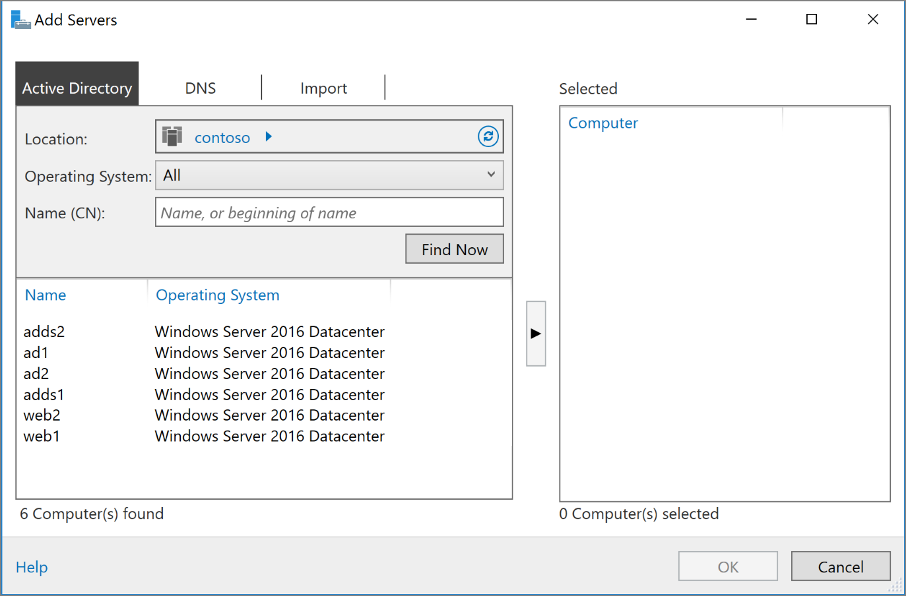

# Extend Active Directory Domain Services (AD DS) to Azure

This reference architecture shows how to extend your Active Directory environment to Azure to provide distributed authentication services using Active Directory Domain Services (AD DS).


For guidance about best practices, see the article [Extend Active Directory Domain Services (AD DS) to Azure](https://docs.microsoft.com/azure/architecture/reference-architectures/identity/adds-extend-domain) on the Azure Architecture Center.

## Deploy the solution

A deployment for this architecture is available on [GitHub][github]. Note that the entire deployment can take up to two hours, which includes creating the VPN gateway and running the scripts that configure AD DS.

### Prerequisites

1. Clone, fork, or download the zip file for the [reference architectures](https://github.com/mspnp/reference-architectures) GitHub repository.

2. Install [Azure CLI 2.0](/cli/azure/install-azure-cli?view=azure-cli-latest).

3. Install the [Azure building blocks](https://github.com/mspnp/template-building-blocks/wiki/Install-Azure-Building-Blocks) npm package.

   ```bash
   npm install -g @mspnp/azure-building-blocks
   ```

4. From a command prompt, bash prompt, or PowerShell prompt, sign into your Azure account as follows:

   ```bash
   az login
   ```

### Deploy the simulated on-premises datacenter

1. Navigate to the `identity/adds-extend-domain` folder of the GitHub repository.

2. Open the `onprem.json` file. Search for instances of `adminPassword` and `Password` and add values for the passwords.

3. Run the following command and wait for the deployment to finish:

    ```bash
    azbb -s <subscription_id> -g <resource group> -l <location> -p onprem.json --deploy
    ```

### Deploy the Azure VNet

1. Open the `azure.json` file.  Search for instances of `adminPassword` and `Password` and add values for the passwords. 

2. In the same file, search for instances of `sharedKey` and enter shared keys for the VPN connection. 

    ```bash
    "sharedKey": "",
    ```

3. Run the following command and wait for the deployment to finish.

    ```bash
    azbb -s <subscription_id> -g <resource group> -l <location> -p azure.json --deploy
    ```

   Deploy to the same resource group as the on-premises VNet.

### Test connectivity with the Azure VNet

After deployment completes, you can test conectivity from the simulated on-premises environment to the Azure VNet.

1. Use the Azure portal, navigate to the resource group that you created.

2. Find the VM named `ra-onpremise-mgmt-vm1`.

3. Click `Connect` to open a remote desktop session to the VM. The username is `contoso\testuser`, and the password is the one that you specified in the `onprem.json` parameter file.

4. From inside your remote desktop session, open another remote desktop session to 10.0.4.4, which is the IP address of the VM named `adds-vm1`. The username is `contoso\testuser`, and the password is the one that you specified in the `azure.json` parameter file.

5. From inside the remote desktop session for `adds-vm1`, go to **Server Manager** and click **Add other servers to manage.** 

6. In the **Active Directory** tab, click **Find now**. You should see a list of the AD, AD DS, and Web VMs.

   

<!-- links -->
[GitHub]: https://github.com/mspnp/reference-architectures/tree/master/identity/adds-extend-domain