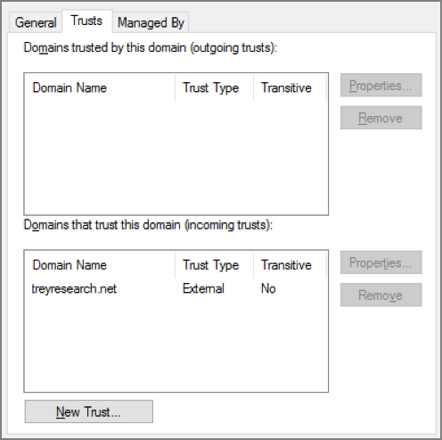

# Create an Active Directory Domain Services (AD DS) resource forest in Azure

This reference architecture shows how to create a separate Active Directory domain in Azure that is trusted by domains in your on-premises AD forest.


For guidance about best practices, see the article [Create an Active Directory Domain Services (AD DS) resource forest in Azure](https://docs.microsoft.com/azure/architecture/reference-architectures/identity/adds-forest) on the Azure Architecture Center.

## Deploy the solution

A deployment for this architecture is available on [GitHub][github]. Note that the entire deployment can take up to two hours, which includes creating the VPN gateway and running the scripts that configure AD DS.

### Prerequisites

1. Clone, fork, or download the zip file for the [reference architectures](https://github.com/mspnp/reference-architectures) GitHub repository.

2. Install [Azure CLI 2.0](/cli/azure/install-azure-cli?view=azure-cli-latest).

3. Install the [Azure building blocks](https://github.com/mspnp/template-building-blocks/wiki/Install-Azure-Building-Blocks) npm package.

   ```bash
   npm install -g @mspnp/azure-building-blocks
   ```

4. From a command prompt, bash prompt, or PowerShell prompt, sign into your Azure account as follows:

   ```bash
   az login
   ```

### Deploy the simulated on-premises datacenter

1. Navigate to the `identity/adds-forest` folder of the GitHub repository.

2. Open the `onprem.json` file. Search for instances of `adminPassword` and `Password` and add values for the passwords.

3. Run the following command and wait for the deployment to finish:

    ```bash
    azbb -s <subscription_id> -g <resource group> -l <location> -p onprem.json --deploy
    ```

### Deploy the Azure VNet

1. Open the `azure.json` file. Search for instances of `adminPassword` and `Password` and add values for the passwords.

2. In the same file, search for instances of `sharedKey` and enter shared keys for the VPN connection. 

    ```bash
    "sharedKey": "",
    ```

3. Run the following command and wait for the deployment to finish.

    ```bash
    azbb -s <subscription_id> -g <resource group> -l <location> -p azure.json --deploy
    ```

   Deploy to the same resource group as the on-premises VNet.


### Test the AD trust relation

1. Use the Azure portal, navigate to the resource group that you created.

2. Use the Azure portal to find the VM named `ra-adt-mgmt-vm1`.

2. Click `Connect` to open a remote desktop session to the VM. The username is `contoso\testuser`, and the password is the one that you specified in the `onprem.json` parameter file.

3. From inside your remote desktop session, open another remote desktop session to 192.168.0.4, which is the IP address of the VM named `ra-adtrust-onpremise-ad-vm1`. The username is `contoso\testuser`, and the password is the one that you specified in the `azure.json` parameter file.

4. From inside the remote desktop session for `ra-adtrust-onpremise-ad-vm1`, go to **Server Manager** and click **Tools** > **Active Directory Domains and Trusts**. 

5. In the left pane, right-click on the contoso.com and select **Properties**.

6. Click the **Trusts** tab. You should see treyresearch.net listed as an incoming trust.



<!-- links -->
[github]: https://github.com/mspnp/reference-architectures/tree/master/identity/adds-forest
